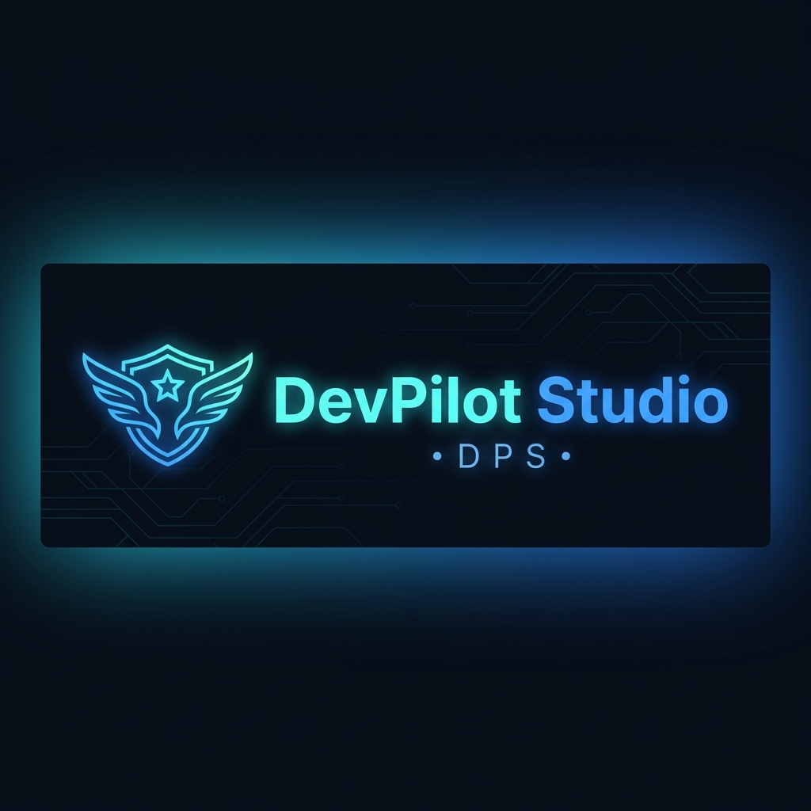
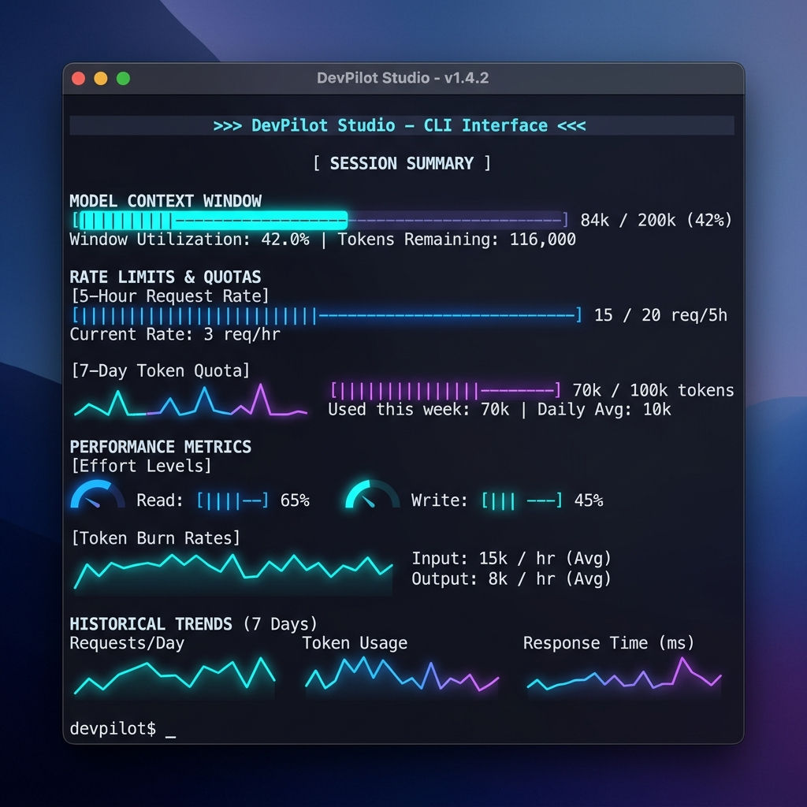
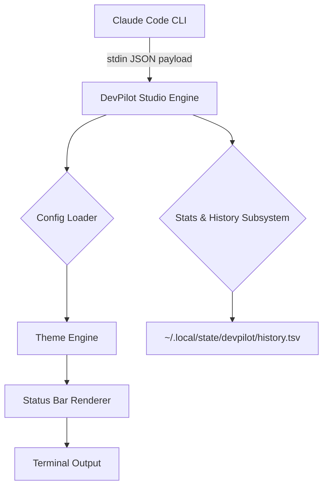

<div align="center">



# DevPilot Studio (DPS) 🚀

**A Professional-Grade Claude Code Marketplace Plugin**  
*Real-Time Terminal Status Bar, Usage Analytics, and Rate Limit Monitoring*

<br/>

[](https://github.com/mr-kumuditha/devpilot-studio)
[](https://github.com/mr-kumuditha/devpilot-studio)
[](LICENSE)
[](https://github.com/mr-kumuditha/devpilot-studio)
[](https://github.com/mr-kumuditha/devpilot-studio/actions)
[](docs/SECURITY.md)

[Features](#2-features) • [Installation](#4-installation) • [Configuration](#6-configuration) • [FAQ](#15-faq)

<br/>

> **DevPilot Studio** is a beautifully designed, highly customizable terminal plugin that gives you complete visibility into your Claude Code AI sessions. Track context window capacity, rate limits, session costs, and velocity alerts — directly in your terminal, with zero external dependencies and 100% offline privacy.

</div>

---

## 2. Features

| Feature | Description |
| :--- | :--- |
| **Claude Code Plugin Integration** | Natively integrates with the Claude Code Marketplace with full slash-command support. |
| **Real-Time Status Bar** | Tracks your active AI model, effort level, and workspace context directly at the terminal prompt. |
| **Usage Tracking** | Live progress bars for context window capacity, 5-hour, and 7-day rate limits (Claude Pro). |
| **Token Velocity Alerts** | Intelligently calculates burn-rate and warns when your session projects hitting quotas. |
| **Cost Estimation** | Tracks the live session cost (in USD) using Anthropic API payloads. |
| **Cross-Platform Support** | Pure POSIX Bash implementation supports macOS, Linux, and Windows (via WSL). |
| **Plugin Architecture** | Zero runtime dependencies. Relies only on standard tools like `jq` and `bash`. |
| **Advanced Configuration** | Interactive UI wizards to select color themes (`vivid`, `mono`) and bar styles. |

---

## 3. Screenshots

<div align="center">
  <br/>
  
  <p><em>Real-Time Terminal Status Bar (Default Theme)</em></p>
</div>

### Terminal Text Preview (Vivid Theme)
```text
Claude 3.7 Sonnet high -> devpilot-studio $0.42
ctx ▓▓▓▓░░░░░░ 42%   5h  ▓▓▓▓▓▓░░░░ 63% (resets 2h 15m) ⚠ 1h 36m   7d  ▓▓▓▓▓▓▓▓░░ 88% (resets 3d 4h) ⚠ 12h 32m
```

*More screenshots coming soon:*
- **Interactive Configuration Wizard** (`dps config`)
- **7-Day Trend Sparklines** (`dps history`)
- **Live Stats Panel** (`dps stats`)

---

## 4. Installation

DevPilot Studio offers multiple ways to install, depending on your workflow.

### Option A: Claude Code Marketplace (Recommended)
```bash
/plugin marketplace add mr-kumuditha/devpilot-studio
/plugin install devpilot-studio
```

### Option B: Local NPX Execution
If you prefer not to add a marketplace:
```bash
npx devpilot-studio
```

### Option C: Standalone Bash Installer
```bash
curl -fsSL https://raw.githubusercontent.com/mr-kumuditha/devpilot-studio/main/install.sh | bash
```

### Option D: Build from Source
```bash
git clone https://github.com/mr-kumuditha/devpilot-studio.git
cd devpilot-studio
chmod +x scripts/setup.sh
./scripts/setup.sh
```

For more details, see [docs/INSTALL.md](docs/INSTALL.md).

---

## 5. Quick Start

1. **Install the Plugin:** From inside Claude Code, run `/plugin install devpilot-studio`.
2. **Setup:** Run `/devpilot-studio:setup` to wire the plugin into your settings.
3. **Configure:** Run `/devpilot-studio:configure` (or `dps config` in a normal shell) to launch the interactive theme wizard.
4. **Restart:** Exit Claude Code (`/exit`) and start a new session (`claude`).
5. **Verify:** You will see the beautiful DevPilot Studio status bar at the bottom of your terminal!

To **Update**, run `/plugin update devpilot-studio`.  
To **Uninstall**, run `/devpilot-studio:uninstall`.

---

## 6. Configuration

Configuration is stored in `${XDG_CONFIG_HOME:-$HOME/.config}/devpilot/config`.

| Environment Variable | Description | Default |
| :--- | :--- | :--- |
| `DPS_ORG` | Custom badge text displayed at front of status bar | `""` |
| `DPS_THEME` | Color theme (`default`, `mono`, `vivid`, `custom`) | `default` |
| `DPS_BAR_WIDTH` | Progress bar width in character cells | `10` |
| `DPS_BAR_FILLED` | Character used for filled portion of progress bar | `█` |
| `DPS_BAR_EMPTY` | Character used for empty portion of progress bar | `░` |
| `DPS_LAYOUT` | Comma-separated order of line-2 segments; unknown names skipped | `ctx,5h,7d,over` |
| `DPS_ICONS` | Use Nerd Font glyphs instead of plain-text segment labels (`1`/`0`) | `0` |
| `DPS_TRUECOLOR` | Allow `DPS_COLOR_*` hex values on the `custom` theme (`1`/`0`) | `0` |
| `DPS_THRESHOLD_MID` | Percent at which bars switch to the "mid" color (int 0–100, `< HIGH`) | `50` |
| `DPS_THRESHOLD_HIGH` | Percent at which bars switch to the "high" color (int 0–100) | `80` |
| `DPS_COLOR_*` | Per-role colors for `DPS_THEME=custom` (raw ANSI, or hex with `DPS_TRUECOLOR=1`). Full list in [docs/CONFIGURATION.md](docs/CONFIGURATION.md). | default theme |
| `DPS_SHOW_EFFORT` | Toggle display of model effort level (`1`/`0`) | `1` |
| `DPS_SHOW_CTX` | Toggle display of context window capacity bar (`1`/`0`) | `1` |
| `DPS_SHOW_5H` | Toggle display of 5-hour rate limit bar (`1`/`0`) | `1` |
| `DPS_SHOW_7D` | Toggle display of 7-day rate limit bar (`1`/`0`) | `1` |
| `DPS_SHOW_OVERAGE` | Toggle display of the overage bar (`1`/`0`) | `0` |
| `DPS_SHOW_COST` | Toggle display of session cost (`1`/`0`) | `0` |
| `DPS_SHOW_BURN` | Toggle velocity burn-rate warning (`1`/`0`) | `1` |
| `DPS_SHOW_CREDIT` | Append a dim `· tharinda.dev` credit to line 1 (`1`/`0`) | `0` |
| `DPS_HISTORY` | Toggle local history logging (`1`/`0`) | `1` |

For advanced customization, the full `DPS_COLOR_*` list, and named presets (`dps theme save/use/list`), see [docs/CONFIGURATION.md](docs/CONFIGURATION.md).

---

## 7. Usage

Once installed, DevPilot provides a standalone CLI binary called `dps` (or `devpilot`).

| Command | Description | Example Output |
| :--- | :--- | :--- |
| `dps config` | Runs interactive setup wizard | `Choose theme: [1] default, [2] mono...` |
| `dps theme <name>` | Switches color theme only (`default`/`mono`/`vivid`), keeping all other settings | `Theme set to "vivid" → ...config` |
| `dps stats` | Displays expanded live usage panel | `Context: 84k / 200k (42%)` |
| `dps history` | Displays 7-day sparkline charts | `5h peak   ▃▆▇▄▅▅▅` |
| `dps gallery` | Previews and applies preset themes | `Applying 'vivid' theme...` |
| `dps demo` | Live status bar preview with sample data | `Opus 4.8 high -> my-project...` |
| `dps render` | Reads JSON from stdin and renders bar | *(Renders status line string)* |
| `dps uninstall` | Safely removes statusLine hooks | `Backed up settings to .bak...` |

---

## 8. Architecture

DevPilot Studio uses a clean, pipe-driven architecture that hooks into the Claude Code `statusLine` command stream.



For an in-depth breakdown of the bash engine, read [docs/ARCHITECTURE.md](docs/ARCHITECTURE.md).

---

## 9. Plugin Architecture

This repository conforms strictly to the **Claude Code Plugin API**.

- **Manifests:** Extends Claude Code via `.claude-plugin/plugin.json` and `marketplace.json`.
- **Lifecycle:** `hooks/hooks.json` registers a `Setup` hook that runs `scripts/setup.sh`. Claude Code fires `Setup` hooks only for `claude --init` / `--maintenance`, so the normal install flow is to run `/devpilot-studio:setup` once by hand (see [Quick Start](#5-quick-start)).
- **Slash Commands:** Command definitions in `commands/*.md` map user intents (like `/devpilot-studio:configure`) securely to the isolated `dps` binary via Bash allowlists.

---

## 10. Building

Because DevPilot Studio is built in POSIX Bash, there is no compilation step. The repository *is* the build.

**Dependencies:**
- `jq` (required for JSON parsing)
- `node` (only if installing via NPM/NPX)

To package the tool into a standalone tarball:
```bash
tar -czf devpilot-studio.tar.gz --exclude='.git' .
```

---

## 11. Development

We welcome contributors! To run a local development environment:

1. Clone the repo and edit `bin/devpilot`.
2. Test your changes against the sample payload fixture without affecting your live config:
   ```bash
   cat test/sample-input.json | bin/devpilot render
   ```
3. Run the built-in demo suite:
   ```bash
   bin/devpilot demo stats
   ```

See [docs/DEVELOPMENT.md](docs/DEVELOPMENT.md) for testing and linting (`shellcheck`) requirements.

---

## 12. GitHub Releases

We use automated **GitHub Actions** (`ci.yml` and `release.yml`).
- Every Push/PR triggers ShellCheck linting and JSON validation.
- Pushing a semver tag (`v1.1.5`) automatically extracts the changelog, builds the release archive artifacts, and publishes a new GitHub Release.

---

## 13. Security

> **Privacy First:** DevPilot Studio operates entirely offline on your local machine.

- **No Outbound Traffic**: The renderer makes zero network requests.
- **No Analytics**: Zero telemetry SDKs or tracking mechanisms.
- **Secure File Access**: History and configuration are stored exclusively in `$XDG_CONFIG_HOME` and `$XDG_STATE_HOME`.

See [docs/SECURITY.md](docs/SECURITY.md) for the full audit report.

---

## 14. Roadmap

**In Progress:**
- Multi-Language documentation translation.
- Interactive MCP server manager in the stats panel.

**Planned:**
- Granular token usage breakdown per agent sub-task.
- Windows native batch script port (removing WSL requirement).

**Future Ideas:**
- Shared organization-wide configurations.

---

## 15. FAQ

**Q: Where are my 5-hour and 7-day rate limit bars?**  
**A:** DevPilot Studio is smart! If you are authenticated via a direct Anthropic API Key (`sk-ant-api...`), you pay per token and lack Claude Pro consumer rate limits. DevPilot detects this and cleanly hides the bars.

**Q: Why doesn't the status bar appear after installation?**  
**A:** You must start a **new** Claude Code session after running `/devpilot-studio:setup`. Just run `/exit` and restart.

**Q: I get "jq not found" — what do I do?**  
**A:** Install it via your package manager (`brew install jq` or `sudo apt-get install -y jq`).

For more answers, see [docs/FAQ.md](docs/FAQ.md).

---

## 16. Contributing

We follow conventional commits and semantic versioning. 
1. Create a feature branch.
2. Ensure your changes pass `shellcheck bin/devpilot`.
3. Open a detailed Pull Request.

Please read our full [docs/CONTRIBUTING.md](docs/CONTRIBUTING.md) guide before submitting.

---

## 17. License

This software is released under the **MIT License**.

You are free to use, modify, distribute, and commercially exploit the software, provided that the original copyright notices are retained in all copies. See the [LICENSE](LICENSE) file for complete details.

---

## 18. Support

Having trouble? We're here to help!
- **Bug Reports:** Open an issue on [GitHub Issues](https://github.com/mr-kumuditha/devpilot-studio/issues).
- **Direct Contact:** Reach out to `dev@tharinda.dev`.

<br/>

<div align="center">
  <sub>DevPilot Studio is an independent developer utility by Kumuditha Labs. "Claude" and "Claude Code" are trademarks of Anthropic PBC.</sub>
</div>
