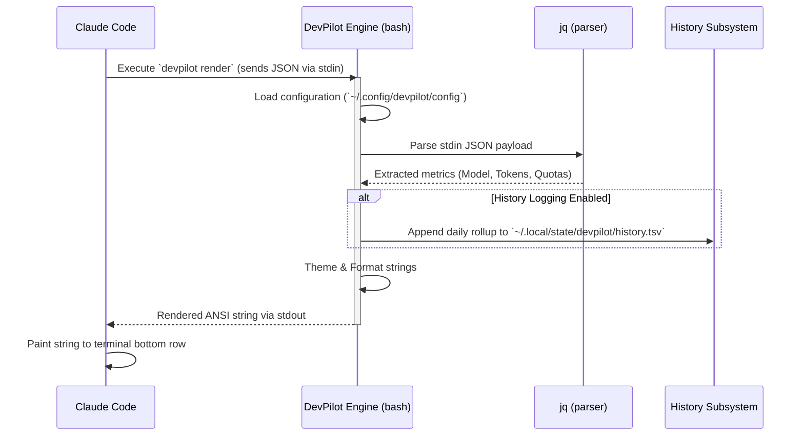

# Architecture Specification

DevPilot Studio is designed with an extremely lightweight, dependency-free architecture. To ensure 100% offline privacy and maximum speed without bogging down the terminal, the core engine is written entirely in POSIX-compliant Bash.

## Execution Flow

Claude Code periodically executes a command defined in its `statusLine` configuration block. It passes a JSON payload representing the current state of the AI session via `stdin` to that command.

DevPilot Studio intercepts this payload and renders a formatted status bar string back to `stdout`.

## Core Components

The primary logic lives in a single monolithic script: `bin/devpilot`.

### 1. Payload Parser
Uses `jq` to traverse the incoming JSON object from Claude Code. It safely extracts deeply nested values such as rate limit thresholds, reset timestamps, and context window utilization, falling back to empty strings if properties are missing (e.g., when the user has API keys instead of Claude Pro limits).

### 2. Rendering Engine
- **Bar Generation**: Converts percentage integers (`0-100`) into visual progress bars using the `DPS_BAR_WIDTH`, `DPS_BAR_FILLED`, and `DPS_BAR_EMPTY` constants.
- **Velocity Subsystem**: Calculates if the current token utilization pace will result in hitting 100% before the reset timer expires.
- **Cost Subsystem**: Multiplies token counts by current Anthropic API prices to estimate session cost.

### 3. State & History (TSV)
To avoid the overhead of a database (like SQLite), DevPilot Studio uses a simple append-only Tab-Separated Value (TSV) file located at `~/.local/state/devpilot/history.tsv`.

The structure is:
`TIMESTAMP \t TYPE \t VALUE \t METADATA`

When a user runs `dps history`, the script parses this TSV using `awk` to extract daily maximums and generates terminal sparklines based on the extracted data.

### 4. Setup Hooks
The `scripts/setup.sh` script is invoked via the `.claude-plugin/hooks.json` lifecycle hook upon plugin installation. It reads `~/.claude/settings.json`, merges the `statusLine` injection, and writes a `.bak` backup file.
