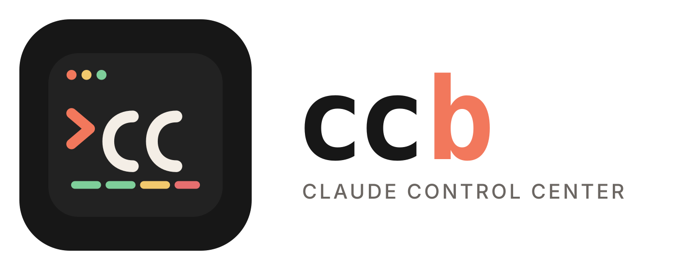

<div align="center">

<picture>
  <source media="(prefers-color-scheme: dark)" srcset="../assets/dps-logo-horizontal-dark.svg">
  
</picture>

**Una línea de estado configurable para [Claude Code](https://claude.com/claude-code)**<br>
Consulta tu modelo, nivel de esfuerzo, espacio de trabajo y uso en tiempo real de un vistazo.

[](https://www.npmjs.com/package/devpilot-studio)
[](../LICENSE)
[](#requirements)

[English](../README.md) · [简体中文](README.zh-CN.md) · **Español** · [हिन्दी](README.hi.md) · [Português](README.pt-BR.md) · [日本語](README.ja.md) · [Français](README.fr.md) · [한국어](README.ko.md) · [සිංහල](README.si.md)

</div>

---

`dps` renderiza una línea de estado compacta de dos líneas debajo de tu prompt de Claude Code:

<p align="center">
  
</p>

- **Línea 1** — una insignia opcional de organización/etiqueta, el nombre del modelo, el nivel de esfuerzo actual, el directorio del espacio de trabajo y (opcionalmente) el **costo de sesión** en curso.
- **Línea 2** — barras de uso coloreadas para tu **ventana de contexto**, el límite de tasa de **5 horas** y el límite de tasa de **7 días**, además de una barra opcional de **excedente** para el gasto de pago por uso, cada una con una cuenta atrás hasta el momento en que se reinicia.

Las barras cambian de 🟢 verde → 🟡 amarillo → 🔴 rojo a medida que se llenan, así puedes ver de un vistazo cuánto margen te queda.

Unos pocos extras te ayudan a gestionar el uso más allá de las barras principales:

- **Ventana de 5 horas inactiva** — antes de que hayas enviado tu primer mensaje, la ventana de 5 horas no ha empezado, así que dps muestra `5h idle` para indicar que el reloj no está corriendo. (El límite de 5 horas de Claude es una ventana móvil anclada a tu primer mensaje — enviar un mensaje rápido y desechable mientras estás inactivo inicia la ventana antes de tiempo y acorta cualquier espera posterior).
- **Advertencia de ritmo de consumo** — cuando tu ritmo actual proyecta agotar un límite *antes* de que se reinicie, dps añade una estimación `⚠ <time>` a esa barra. Activada de forma predeterminada; desactívala en `dps config`.
- **Barra de excedente** *(opcional)* — una barra `over` independiente que rastrea el gasto de pago por uso/uso adicional, separada de las cuotas del plan de 5 horas y 7 días (una cuenta Pro/Max puede tener ambas a la vez). Desactivada de forma predeterminada; actívala en `dps config`.

Más allá de la línea de estado, dps te ofrece dos comandos de terminal: **[`dps stats`](#usage-insights)** para un panel de uso ampliado, y **[`dps history`](#usage-insights)** para las tendencias de uso de los últimos 7 días.

---

## Instalación

```sh
npx devpilot-studio
```

O con curl:

```sh
curl -fsSL https://raw.githubusercontent.com/mr-kumuditha/devpilot-studio/main/install.sh | bash
```

El instalador hará lo siguiente:

1. Instalar el script `dps` en `~/.local/bin/devpilot`.
2. Integrarlo en `~/.claude/settings.json` como tu línea de estado (haciendo primero una copia de seguridad del archivo).
3. Ejecutar un **asistente de configuración interactivo** para que puedas elegir tu etiqueta, segmentos, tema y estilo de barra.

Luego **inicia una nueva sesión de Claude Code** (o reiníciala) para ver tu línea de estado.

> ¿Prefieres no canalizar la salida a `bash`? Consulta [Instalación manual](#manual-install).

<a id="requirements"></a>
## Requisitos

- **bash** (la versión 3.2 integrada en macOS es suficiente) y `date` de coreutils
- **[jq](https://jqlang.github.io/jq/)** — se usa para leer el JSON de estado de Claude Code y para editar tu configuración de forma segura
  - macOS: `brew install jq`
  - Debian/Ubuntu: `sudo apt-get install jq`
  - Fedora: `sudo dnf install jq` · Arch: `sudo pacman -S jq` · Alpine: `sudo apk add jq`

## Configuración

Ejecuta el asistente en cualquier momento:

```sh
dps config
```

Escribe un archivo sencillo y editable a mano en `~/.config/devpilot-studio/config`:

| Key                 | Predeterminado | Descripción                                                        |
| ------------------- | ------- | ------------------------------------------------------------------ |
| `DPS_ORG`         | *(vacío)* | Etiqueta mostrada al principio (p. ej. tu empresa). En blanco la oculta.    |
| `DPS_THEME`       | `default` | Tema de color: `default`, `mono` o `vivid`.                      |
| `DPS_BAR_WIDTH`   | `10`    | Ancho de cada barra de uso, en celdas.                                 |
| `DPS_BAR_FILLED`  | `█`     | Carácter para la parte llena de una barra.                         |
| `DPS_BAR_EMPTY`   | `░`     | Carácter para la parte vacía de una barra.                          |
| `DPS_SHOW_EFFORT` | `1`     | Muestra el nivel de esfuerzo (`1`/`0`).                                   |
| `DPS_SHOW_CTX`    | `1`     | Muestra la barra de la ventana de contexto (`1`/`0`).                             |
| `DPS_SHOW_5H`     | `1`     | Muestra la barra de uso de 5 horas (`1`/`0`).                             |
| `DPS_SHOW_7D`     | `1`     | Muestra la barra de uso de 7 días (`1`/`0`).                              |
| `DPS_SHOW_OVERAGE`| `0`     | Muestra la barra de excedente de pago por uso (`1`/`0`).                     |
| `DPS_SHOW_COST`   | `0`     | Muestra el costo de sesión en curso en la línea 1 (`1`/`0`).                 |
| `DPS_SHOW_BURN`   | `1`     | Advierte (`⚠ <time>`) cuando tu ritmo agotará un límite antes de tiempo (`1`/`0`). |
| `DPS_HISTORY`     | `1`     | Registra instantáneas de uso para `dps history` (`1`/`0`).              |

Cada valor tiene un valor predeterminado sensato, por lo que una configuración ausente o parcial se sigue renderizando correctamente.

### Temas

| Tema      | Aspecto                                |
| --------- | -------------------------------------- |
| `default` | Colores sutiles y atenuados (recomendado)    |
| `mono`    | Solo escala de grises — se integra en cualquier prompt |
| `vivid`   | Colores brillantes y de alto contraste           |

## Comandos

Muestra un panel de uso ampliado (consulta [Perspectivas de uso](#usage-insights)).

```sh
dps stats
```

Muestra las tendencias de uso de los últimos 7 días (consulta [Perspectivas de uso](#usage-insights)).

```sh
dps history
```

Ejecuta el asistente de configuración interactivo.

```sh
dps config
```

Explora aspectos preconfigurados y, opcionalmente, aplica uno.

```sh
dps gallery
```

Previsualiza con datos de ejemplo — la línea de estado, o (con `stats`/`history`) cualquiera de los paneles de uso.

```sh
dpsRemove devpilot's wiring from Claude Code settings.
```

```sh
dps uninstall
```

Print the version.

```sh
dps version
```

Show help.

```sh
dps help
```

> El comando `dps` reside en `~/.local/bin`. Si eso no está en tu `PATH`, añádelo:
> ```sh
> echo 'export PATH="$HOME/.local/bin:$PATH"' >> ~/.zshrc   # or ~/.bashrc
> ```
> La línea de estado en sí usa una ruta absoluta, por lo que funciona independientemente de tu `PATH`.

<a id="usage-insights"></a>
## Perspectivas de uso

dps **no hace llamadas de red** y **no tiene credenciales** — solo ve el JSON que Claude Code canaliza a `dps render`. Para hacer que esos datos sean útiles fuera of la línea de estado, `render` almacena en caché el payload más reciente (y registra un pequeño historial móvil), que dos comandos leen de vuelta. Pruébalos con datos de ejemplo mediante `dps demo stats` y `dps demo history`.

### `dps stats`

Un panel de uso ampliado y bajo demanda — modelo, sesión (5h), semanal (7d), contexto, costo, cuentas atrás de reinicio y tu ritmo actual:

```
DevPilot Studio — usage

  Model     Opus 4.8 (high)
  Session   ██████░░░░ 63%   resets in 2h 15m
            hits limit in ~1h 36m
  Weekly    ████████░░ 88%   resets in 3d 4h
  Context   ████░░░░░░ 42%   84k / 200k
  Cost      $0.42
  Updated   12s ago
```

Lee el payload más reciente que Claude Code le pasó a `dps render` (capturado en cada redibujado y sellado con hace cuánto tiempo ocurrió). Canaliza JSON nuevo — `… | dps stats` — para reemplazarlo.

### `dps history`

Tendencias de uso de los últimos 7 días — una sparkline de los picos diarios de 5 horas, el uso semanal actual, una tabla por día (pico de % 5h/7d, costo estimado) y tu ritmo de consumo medido:

```
DevPilot Studio — history (last 7 days)

  5h peak   ▃▆▇▄▅▅▅   now 63%
  7d        ████████░░ 86%

  Date      5h peak 7d peak     ~cost
  Jul 24        63%     86%     $2.64
  Jul 23        70%     85%     $3.44
  Jul 22        63%     84%     $3.46

  Burn (last hr)  ~22%/h → hits 5h limit in ~1h 40m
```

`render` registra una instantánea limitada (como máximo una por minuto) en `${XDG_STATE_HOME:-~/.local/state}/devpilot-studio/history.tsv`, y `history` la resume. Solo refleja el tiempo que Claude Code estuvo abierto, y el costo diario es una estimación (sumada por sesión). Establece `DPS_HISTORY=0` para desactivar el registro por completo; borra el archivo para reiniciarlo.

## Cómo funciona

Claude Code admite [líneas de estado personalizadas](https://docs.claude.com/en/docs/claude-code/statusline): ejecuta un comando y canaliza un objeto JSON (modelo, espacio de trabajo, ventana de contexto, límites de tasa) a su stdin, y luego muestra lo que sea que imprima el comando. `dps` lee ese JSON con `jq` y renderiza la barra de dos líneas.

El instalador añade esto a `~/.claude/settings.json` (fusionándolo, sin sobrescribir nunca tus otras configuraciones):

```json
{
  "statusLine": {
    "type": "command",
    "command": "/Users/you/.local/bin/devpilot render",
    "padding": 0
  }
}
```

<a id="manual-install"></a>
## Instalación manual

```sh
# 1. Descarga el script
mkdir -p ~/.local/bin
curl -fsSL https://raw.githubusercontent.com/mr-kumuditha/devpilot-studio/main/bin/devpilot -o ~/.local/bin/devpilot
chmod +x ~/.local/bin/devpilot

# 2. Configúralo
~/.local/bin/devpilot config

# 3. Apunta Claude Code a él (añádelo a ~/.claude/settings.json)
#    "statusLine": { "type": "command", "command": "~/.local/bin/devpilot render", "padding": 0 }
```

## Desinstalación

```sh
dps uninstall
```

Elimina la entrada `statusLine` de `~/.claude/settings.json` (con una copia de seguridad `.bak`) y, opcionalmente, borra el binario y la configuración.

## Solución de problemas

- **La línea de estado no aparece** — inicia una sesión *nueva* de Claude Code; la línea de estado se carga al inicio de la sesión.
- **`jq not found`** — instala `jq` (consulta [Requisitos](#requirements)).
- **Caracteres rotos en las barras** — puede que la fuente de tu terminal carezca de glifos de bloque; ejecuta `dps config` y elige el estilo de barra ascii `=-`.

## Contribuir

Se agradecen los issues y PRs — [abre un issue](https://github.com/mr-kumuditha/devpilot-studio/issues). `dps` es un único script portable de bash (`bin/devpilot`) sin paso de compilación — edítalo y luego ejecuta `bin/devpilot demo` para previsualizarlo.ejecuta `dps config` y elige el estilo de barra ascii `=-`.

## Contribuir

Se agradecen los issues y PRs — [abre un issue](https://github.com/mr-kumuditha/devpilot-studio/issues). `dps` es un único script portable de bash (`bin/devpilot`) sin paso de compilación — edítalo y luego ejecuta `bin/dps demo` para previsualizarlo.

## Enlaces

| | |
| --- | --- |
| Sitio web | [kumuditha.dev](https://kumuditha.dev) |
| Documentación | [docs.kumuditha.dev](https://docs.kumuditha.dev) |
| Soporte | [support.kumuditha.dev](https://support.kumuditha.dev) · [support@kumuditha.dev](mailto:support@kumuditha.dev) |
| Contacto | [hello@kumuditha.dev](mailto:hello@kumuditha.dev) |
| Código fuente | [github.com/mr-kumuditha/devpilot-studio](https://github.com/mr-kumuditha/devpilot-studio) |

## Créditos

DevPilot Studio incluye software derivado de [ccbar](https://github.com/lakpriya1s/ccbar) de Lakpriya Senevirathna, usado bajo la Licencia MIT. Consulta [NOTICE.md](../NOTICE.md) para los avisos legales completos.

«Claude» y «Claude Code» son marcas registradas de Anthropic PBC. Esta es una herramienta independiente y no oficial, sin afiliación ni respaldo de Anthropic.

## Licencia

[MIT](../LICENSE) — © 2026 Kumuditha Tharinda Liyanage ([Kumuditha Labs](https://kumuditha.dev)), partes © 2026 Lakpriya Senevirathna.
